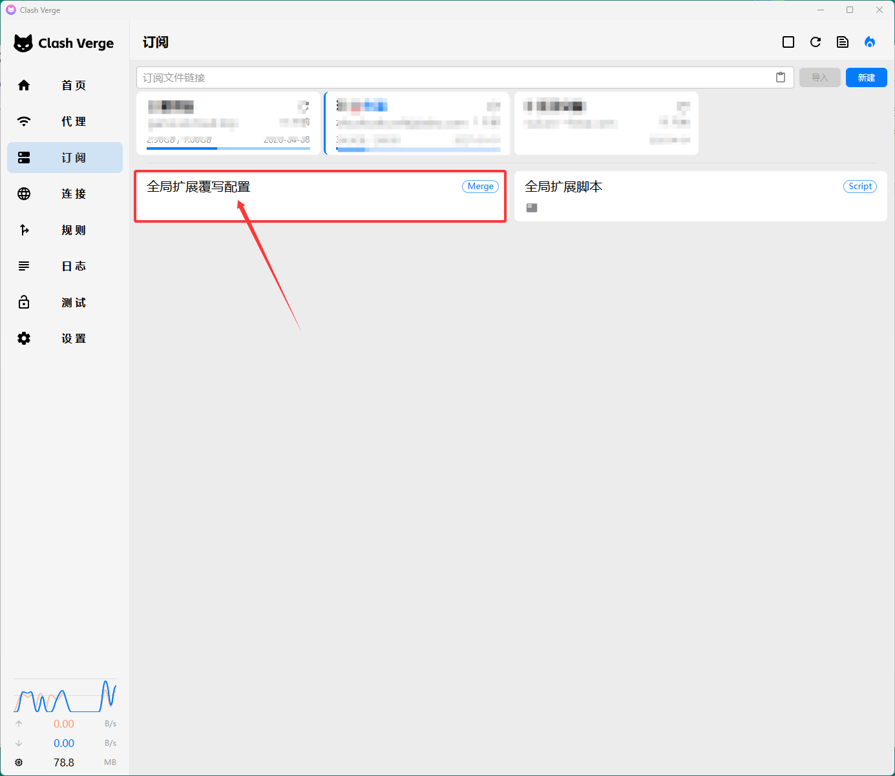

# clash

是一个网络代理工具，本质上是一个“流量转发与规则控制引擎”

## 客户端

- [clash-verge-rev](https://github.com/clash-verge-rev/clash-verge-rev)

## 功能介绍

1. 规则模式
   按规则自动分流（最常用），规则通常由订阅的节点控制
2. 全局模式
   - 本质:
     - Clash 内部规则改成“全部走代理”
   - 特点:
     - ✅ 设置简单，不用管规则
     - ✅ 所有请求都走代理节点
     - ❗ 不接管系统底层流量（某些程序可能绕过）
     - ❗ 国内流量也会绕路 → 速度可能变慢
     - ❗ DNS、UDP 支持取决于配置
   - 适合场景:
     - 临时“全部翻墙”
     - 测试节点速度
     - 不想配置规则的新手
3. 直连模式
   完全不走代理
4. Tun模式
   - 本质:
     - 创建一个虚拟网卡，像 VPN 一样接管系统流量
   - 特点:
     - ✅ 可以代理所有应用（包括不支持代理的软件、游戏、系统服务等）
     - ✅ 支持 UDP（对游戏、语音很关键）
     - ✅ 仍然可以用规则（分流：国内直连 / 国外代理）
     - ❗ 需要更高权限（有时需要管理员权限）
     - ❗ 可能略微增加系统资源占用
   - 适用场景:
     - 游戏加速（尤其 UDP）
     - 一些“无代理设置”的软件
     - 想做到真正“全局透明代理 + 分流”

## 更多

如果使用导入的节点，部分服务无法访问。可以去试试以下办法：

1. 打开客户端，找到如图入口
2. 前往[clash-rules](https://github.com/Loyalsoldier/clash-rules)把这个仓库里的 `rule` 和 `代理规则` 全扔进去就行了
