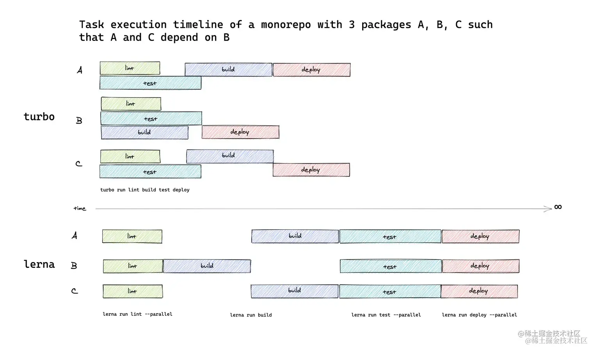
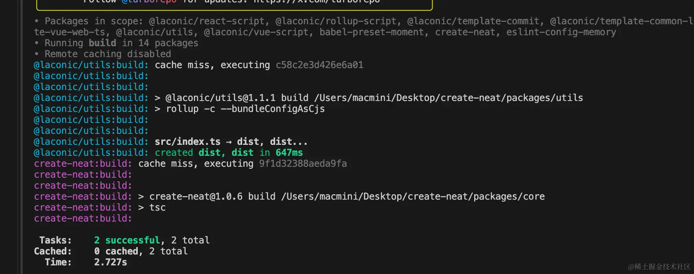
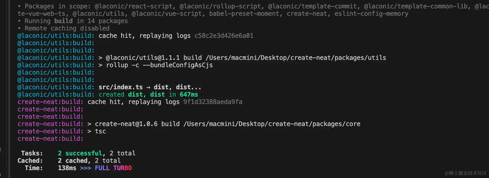

# turborepo

## 简介

- Turborepo 是一个高性能的构建系统，专为 JavaScript 和 TypeScript 的 Monorepo 项目设计。它提供了一种高效管理和构建项目中多个包的方式，通过`缓存`先前构建和测试的`结果`来显著减少重复工作的需要，从而加快开发和持续集成的流程。
- Turborepo 旨在提高大型 Monorepo 项目的构建效率，特别是在复杂的项目中，它可以处理依赖关系、执行任务、并确保构建的正确性和效率。

## 优势

1.  **多任务并行处理**

    Turborepo 支持多个任务的并行运行，在执行任何任务之前，Turborepo 首先分析项目中各个包之间的依赖关系。这包括识别包之间的直接依赖以及跨包的间接依赖。通过这种依赖分析，Turborepo 能够构建出一个执行任务的依赖图，确保在执行任何特定任务之前，其所有依赖项都已经被处理。

    依据构建的依赖图，Turborepo 使用一种智能调度算法来决定任务的执行顺序。它会并行执行那些彼此之间没有依赖关系的任务，而将有依赖关系的任务按正确的顺序排队执行。这种方法最大化地利用了系统的 CPU 和内存资源，同时确保了构建过程的正确性。

    在传统的 Monorepo 任务管理中虽然可以执行一些基本的并行操作，但通常缺乏一个综合策略来最大化并行效率，可能导致资源未充分利用。在没有智能管理的情况下，同时运行多个重资源任务可能会导致性能瓶颈，影响任务执行效率。

    为了可以了解 turbo 多么强大，下图比较了 turbo vs lerna 任务执行时间线：
    

    Turbo 它能够有效地安排任务类似于瀑布可以同时异步执行多个任务，而 lerna 一次只能执行一项任务 所以 Turbo 的 性能不言而喻。

    假设一个 Monorepo 项目包含三个包：A，B，和 C，其中 A 依赖于 B 和 C，但 B 和 C 之间没有依赖关系。在这种情况下，Turborepo 会同时启动 B 和 C 的构建任务，因为它们可以独立完成。只有当 B 和 C 的任务都完成后，它才会开始执行 A 的构建任务。

2.  **增量构建**

    增量构建意味着在构建过程中，只有自上次成功构建以来发生变化的部分才会被重新构建，而未更改的部分则会跳过，直接使用上次构建的结果。

    Turborepo 首先分析项目的依赖图，包括识别各个包之间的依赖关系。这是增量构建的基础，确保只有当依赖的包发生变化时，依赖它们的包才会被重新构建。

    使用文件指纹（或哈希）技术来确定文件自上次构建以来是否发生了更改。通过比较文件的当前指纹与存储在缓存中的上一次构建指纹，Turborepo 能够快速识别哪些文件需要重新构建。

    Turborepo 利用先进的`缓存机制`来存储构建结果，包括编译后的代码、测试结果等。如果检测到某个包或任务自上次构建以来没有变化（基于文件指纹比较），Turborepo 将跳过这些任务的执行，并直接使用缓存中的结果。

    第一次打包：

    

    第二次打包：

    

    从上面的图我们应该可以看得出，我们并没有对文件就行修改，打包的速度和第一次相比直接少了 2s 多。

3.  **云缓存**

    云缓存功能是其高效构建系统的关键特性之一，它允许开发团队在云端存储和共享构建缓存。这种机制不仅提高了构建和测试的速度，还增强了团队成员间的协作效率，尤其是在大型 Monorepo 项目中。

    云缓存基于一个简单的原理：将构建任务的输出（如编译代码、测试结果等）存储在云端服务中。当相同的任务在未来被触发时，Turborepo 首先检查云缓存中是否存在相应的输出。如果存在，它将直接使用缓存的结果，而不是重新执行任务。这种机制依赖于对任务输入（如源代码文件）的敏感度分析，确保仅当输入未发生变化时，才复用缓存结果。

    它主要包括了以下几个优点：

    1. 构建速度提升：通过避免重复执行未更改的任务，云缓存显著减少了构建和测试所需的时间。

    2. 团队协作优化：云缓存支持跨团队成员共享，意味着一个团队成员的构建结果可以被其他成员复用，进一步提高了整个团队的工作效率。

    3. CI/CD 效率增强：在持续集成/持续部署（CI/CD）流程中，云缓存可以跨不同构建和部署任务共享，减少了构建步骤，加快了软件交付速度。

    4. 资源优化：减少了对计算资源的需求，尤其是在资源受限的环境中，如限制了并行构建数的 CI 服务。
