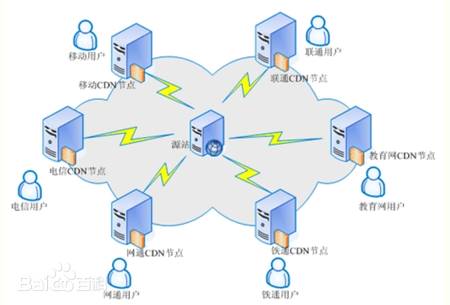
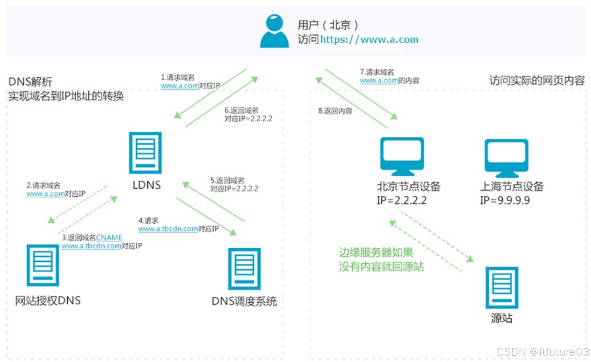

# cdn

### 一、概念

CDN (全称 Content Delivery Network)，即内容分发网络

构建在现有网络基础之上的智能虚拟网络，依靠部署在各地的边缘服务器，通过中心平台的`负载均衡`、`内容分发`、`调度`等功能模块，使用户`就近`获取所需内容，降低网络拥塞，提高用户访问响应速度和命中率。

关键技术主要有`内容存储`和`分发技术`

简单来讲，`CDN`就是根据用户位置分配最近的资源

于是，用户在上网的时候不用直接访问源站，而是访问离他“最近的”一个 CDN 节点，术语叫**边缘节点**，其实就是缓存了源站内容的代理服务器。如下图：

### 二、原理分析

在没有应用`CDN`时，我们使用域名访问某一个站点时的路径为

> 用户提交域名 → 浏览器对域名进行解释 →`DNS` 解析得到目的主机的 IP 地址 → 根据 IP 地址访问发出请求 → 得到请求数据并回复

应用`CDN`后，`DNS` 返回的不再是 `IP` 地址，而是一个`CNAME`(Canonical Name ) 别名记录，指向`CDN`的全局负载均衡

`CNAME`实际上在域名解析的过程中承担了中间人（或者说代理）的角色，这是`CDN`实现的关键

#### 负载均衡系统

由于没有返回`IP`地址，于是本地`DNS`会向负载均衡系统再发送请求 ，则进入到`CDN`的全局负载均衡系统进行智能调度：

- 看用户的 IP 地址，查表得知地理位置，找相对最近的边缘节点
- 看用户所在的运营商网络，找相同网络的边缘节点

- 检查边缘节点的负载情况，找负载较轻的节点
- 其他，比如节点的“健康状况”、服务能力、带宽、响应时间等

结合上面的因素，得到最合适的边缘节点，然后把这个节点返回给用户，用户就能够就近访问`CDN`的缓存代理

整体流程如下图：

1. 当终端用户（北京）向 `www.a.com` 下的指定资源发起请求时，首先向 `LDNS（本地 DNS）`发起域名解析请求。
2. LDNS 检查缓存中是否有 `www.a.com 的IP地址记录`。如果有，则直接返回给终端用户；如果没有，则向 `授权 DNS` 查询。
3. 当 `授权 DNS` 解析 `www.a.com` 时，返回域名**CNAME** `www.a.tbcdn.com` 对应 IP 地址。
4. 域名解析请求发送至阿里云 DNS 调度系统，并为请求`分配最佳节点 IP 地址`。
5. LDNS 获取 DNS 返回的解析 IP 地址。
6. 用户获取解析 IP 地址。
7. 用户向获取的 IP 地址发起对该资源的访问请求。
   - 如果该 IP 地址对应的节点已缓存该资源，则会将数据直接返回给用户，例如，图中步骤 7 和 8，请求结束。
   - 如果该 IP 地址对应的节点未缓存该资源，则节点向源站发起对该资源的请求。获取资源后，结合用户自定义配置的缓存策略，将资源缓存至节点，例如，图中的北京节点，并返回给用户，请求结束。

#### 缓存代理

缓存系统是 `CDN `的另一个关键组成部分，缓存系统会有选择地缓存那些最常用的那些资源

其中有两个衡量`CDN`服务质量的指标：

- 命中率：用户访问的资源恰好在缓存系统里，可以直接返回给用户，命中次数与所有访问次数之比
- 回源率：缓存里没有，必须用代理的方式回源站取，回源次数与所有访问次数之比

缓存系统也可以划分出层次，分成一级缓存节点和二级缓存节点。一级缓存配置高一些，直连源站，二级缓存配置低一些，直连用户

回源的时候二级缓存只找一级缓存，一级缓存没有才回源站，可以有效地减少真正的回源

现在的商业 `CDN`命中率都在 90% 以上，相当于把源站的服务能力放大了 10 倍以上

### 三、总结

`CDN` 目的是为了改善互联网的服务质量，通俗一点说其实就是提高访问速度

`CDN` 构建了全国、全球级别的专网，让用户就近访问专网里的边缘节点，降低了传输延迟，实现了网站加速

通过`CDN`的负载均衡系统，智能调度边缘节点提供服务，相当于`CDN`服务的大脑，而缓存系统相当于`CDN`的心脏，缓存命中直接返回给用户，否则回源
