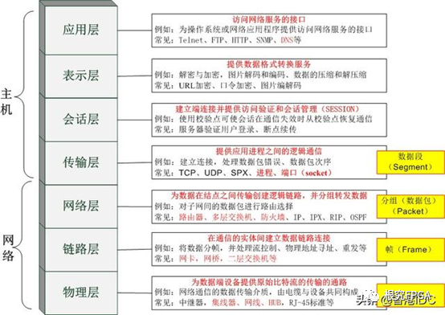
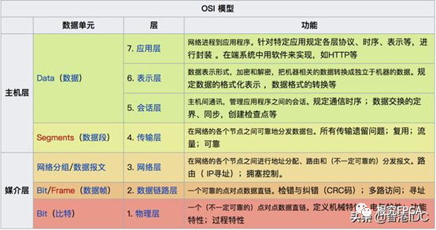

# OSI 七层模型

1. **物理层**:

   - 物理层为设备之间的数据通信提供传输媒体及互连设备，为数据传输提供可靠的环境

   主要功能:

   1. 为数据端设备提供传送数据的通路，数据通路可以是一个物理媒体，也可以是多个物理媒体连接而成
   2. 传输数据。物理层要形成适合数据传输需要的实体，为数据传送服务。
      - 一是要保证数据能在其上正确通过，
      - 二是要提供足够的带宽(带宽是指每秒钟内能通过的比特(Bit)数)，以减少信道上的拥塞。

   - 物理层设备有：集线器、中继器、网线、光猫

2. **数据链路层**:

   - 两台主机之间的数据传输，总是在一段一段的链路上传送的，这就需要使用专门的链路层协议
   - 在两个相邻节点之间传送数据时，数据链路层将网络层交下来的 `IP` 数据报组装成`帧`(Frame)，在两个相邻节点间的链路上传送帧

   每一帧的数据可以分成：报头`head`和数据`data`两部分:

   - head 标明数据发送者、接受者、数据类型，如 MAC 地址
   - data 存储了计算机之间交互的数据

   - 通过控制信息我们可以知道一个帧的起止比特位置，此外，也能使接收端检测出所收到的帧有无差错，如果发现差错，数据链路层能够简单的丢弃掉这个帧，以避免继续占用网络资源
   - 数据链路层设备有：网桥、交换机、网卡

3. **网络层**:

   - 两台计算机之间传送数据时其通信链路往往不止一条，所传输的信息甚至可能经过很多通信子网
   - 为数据在节点之间传输创建逻辑链路，选择合适的网间路由和交换节点，确保数据按时成功传送
   - 在发送数据时，网络层把传输层产生的报文或用户数据报封装成分组和包，向下传输到数据链路层
   - 在网络层使用的协议是无连接的`网际协议`（Internet Protocol）和许多路由协议，因此我们通常把该层简单地称为 IP 层
   - 网络层设备：路由器

4. **传输层**:

   - 为两台主机进程之间的通信提供服务，处理数据包错误、数据包次序，以及其他一些关键传输问题
   - 传输层向高层屏蔽了下层数据通信的细节
   - 主要的传输层协议是`TCP`和`UDP` ‌‌

5. **会话层**:

   - 该层负责`建立`、`管理`和`终止`表示层实体之间的通信会话，管理网络会话生命周期
   - 该层提供了数据交换的定界和同步功能，包括了建立检查点和恢复方案的方法

6. **表示层**:

   - 使通信的应用程序能够解释交换数据的含义
   - 该层提供的服务主要包括`数据压缩`，`数据加密`以及`格式转换`（如 ASCII 编码），使应用程序不必担心在各台计算机中表示和存储的内部格式差异

7. ‌**应用层**:

   - 该层定义了应用进程之间的交互规则，通过不同的`应用层协议`为不同的网络应用提供服务。
   - 例如域名系统 `DNS`，支持万维网应用的 `HTTP` 协议，电子邮件系统采用的 `SMTP `协议，文件传输的 `FTP` 协议等
   - 在应用层交互的`数据单元`我们称之为`报文`

### 简单例子

- 应用层报文被传送到传输层
- 在最简单的情况下，传输层收取到报文并附上附加信息，该首部将被接收端的传输层使用
- 应用层报文和传输层首部信息一道构成了传输层报文段。附加的信息可能包括：允许接收端传输层向上向适当的应用程序交付报文的信息以及差错检测位信息。该信息让接收端能够判断报文中的比特是否在途中已被改变
- 传输层则向网络层传递该报文段，网络层增加了如源和目的端系统地址等网络层首部信息，生成了网络层数据报
- 网络层数据报接下来被传递给链路层，在数据链路层数据报添加发送端 MAC 地址和接收端 MAC 地址后被封装成数据帧
- 在物理层数据帧被封装成比特流，之后通过传输介质传送到对端
- 对端再一步步解开封装，获取到传送的数据
