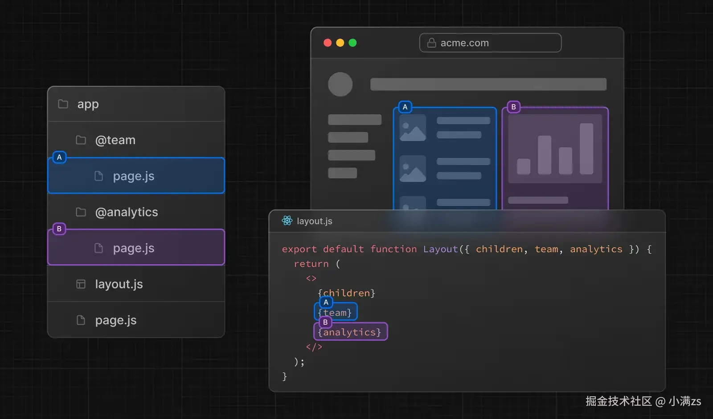
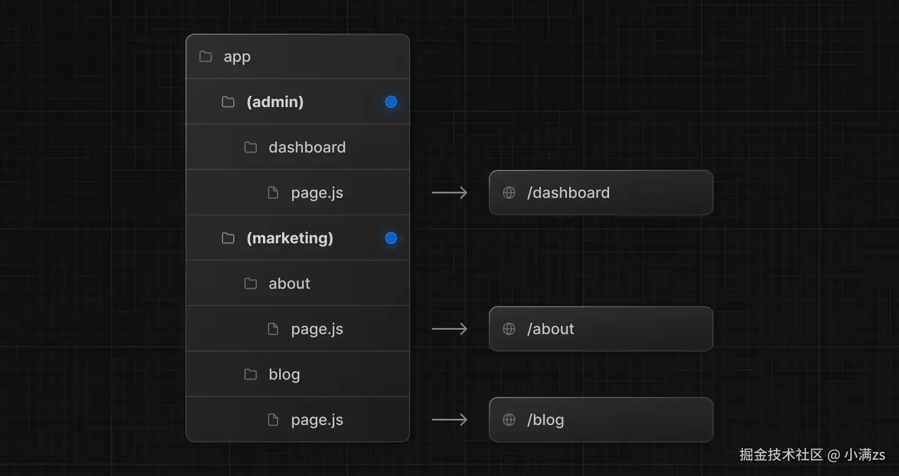

# 介绍

Next.js 是一个基于 React 全栈框架，由 Vercel 开发和维护，那么它有什么优势呢？

- **SSR**: 服务端渲染，可以提高页面加载速度(现在会 SSR 的人才并不多，可以提升你的竞争力)
- **SSG**: 静态站点生成，可以生成静态页面，类似于 Vitepress / Astro 等静态站点生成工具
- **SEO**: Next.js 提供了 SEO 优化，让你的网站更容易被搜索引擎收录
- **AI:** Vercel 提供了 AI SDK 可以跟 Next.js 轻松结合，让你可以轻松实现 AI 应用
- **服务端操作**: Next.js 提供了服务端操作，顺便学习服务端知识，为以后做全栈开发打下基础
- **社区丰富**: Next.js 拥有庞大的社区，可以让你轻松找到解决方案
- **部署:** 支持多种部署选项，与 Vercel 等平台集成良好，可以快速部署

## 什么是 React Compiler?

React Compiler 是 Next.js 用于自动优化组件渲染来提高性能的工具，在之前的话，我们需要手动优化 `useMemo` / `useCallback` / `memo` 等，现在 Next.js 会自动优化，你只需要写代码即可,减少心智负担。

如何开启 React Compiler? `如果你在选项中选择 yes 则无需安装（通过脚手架初始化项目时选择 yes）`

```bash
npm install -D babel-plugin-react-compiler

```

next.config.ts

```ts
import type { NextConfig } from "next";

const nextConfig: NextConfig = {
  reactCompiler: true, //开启即可
};

export default nextConfig;
```

## 什么是 App Router?

Next.js 有两套路由系统，一个是旧的 `Pages Router` 路由系统，一个是新的 `App Router` 路由系统。

首先 Next.js 首推的是 `App Router` 路由系统

- `Pages Router` 的路由系统是会把 `pages` 目录下的所有 jsx/tsx 文件，都转换成路由，例如 `pages/index.tsx` 会转换成 `/` 路由，`pages/about.tsx` 会转换成 `/about` 路由，这样导致我们不能把组件写到 `pages` 目录下

目录结构如下

```txt
 └── pages
    ├── index.tsx -> /
    ├── login.tsx -> /login
    ├── api
    │   └── user.tsx -> /api/user
    ├── posts
    │   └── [id].tsx -> /posts/[id]
    └── blog
        ├── index.tsx -> /blog
        └── setting.tsx -> /blog/setting

```

- `App Router` 的路由系统是根据约定定义的，app 目录下的每个文件夹都代表一个路由段（route segment），并直接映射到 URL 路径。无需配置路由表，框架会根据您的文件结构自动处理，目录结构如下

```txt
src/
└── app
    ├── page.tsx -> / 首页
    ├── layout.tsx -> 布局组件
    ├── template.tsx -> 模板组件
    ├── loading.tsx -> 加载组件
    ├── error.tsx -> 错误组件
    └── not-found.tsx -> 404组件
    ├── xiaoman
    │   └── page.tsx -> /xiaoman 小满页面
    └── daman
        └── page.tsx -> /daman 大满页面

```

- `Pages Router` 读取数据需要使用 `getServerSideProps` / `getStaticProps` / `getStaticPaths` 等函数，而 `App Router` 则不需要，直接在组件中使用 `fetch` 调用即可。

Pages Router:

```tsx
export async function getServerSideProps() {
  const res = await fetch("xxx");
  const data = await res.json();
  return { props: { data } };
}
export default function Home({ data }) {
  return <div>{data.name}</div>;
}
```

App Router:

```tsx
export default async function Home() {
  const res = await fetch("xxx");
  const data = await res.json();
  return <div>{data.name}</div>;
}
```

### layout && template

`layout(布局)` 布局是多个页面共享 UI，例如导航栏、侧边栏、底部等。
`template(模板)` 基本功能跟布局一样，只是不会保存状态

布局和模板的特点就是：

- **布局嵌套**: 支持多层布局嵌套，构建复杂的页面结构
- **状态管理**: 布局会在页面切换时保持状态，而模板会重新渲染
- **根布局**: app/layout.tsx 是必须存在的根布局文件
- **渲染顺序**: 当布局和模板同时存在时，渲染顺序为 layout → template → page

### loading(加载)

Next.js 的 loading 是借助了 `Suspense` 实现的，Suspense 的具体用法请参考 [Suspense 组件](https://message163.github.io/react-docs/react/components/suspense.html)

### error(错误)

Next.js 的 error 是借助了 `Error Boundary` 实现的。

### not-found(404)

其实 Next.js 默认会生成一个 404 页面，但我们可能自定义 404 页面，只需要在 app 目录下创建一个 not-found.tsx 文件即可

### 路由导航

路由导航是指我们在 Next.js 中跳转页面的方式，例如原始的 `<a>` 标签，等。

在 Next.js 中，共有四种方式提供跳转:

- `Link` 组件
- `useRouter` Hook (客户端组件)
- `redirect` 函数 (服务端组件)
- `History` API (浏览器 API 本文略过用的不多 了解即可)

#### Link 组件

`<Link>` 是一个内置组件，在 a 标签的基础上扩展了功能，并且还能用来实现`预获取`(prefetch)，以及保持`滚动`位置(scroll)等。

> prefetch 只会在生产环境（production）被启用

##### 基本用法

```tsx
import Link from "next/link";
export default function Home() {
  return (
    <div>
      <Link href="/about">跳转About页面</Link>
      <Link href={{ pathname: "/about", query: { name: "张三" } }}>
        跳转About并且传入参数
      </Link>
      <Link href="/page" prefetch={true}>
        预获取page页面
      </Link>
      <Link href="/xm" scroll={true}>
        保持滚动位置
      </Link>
      <Link href="/daman" replace={true}>
        替换当前页面
      </Link>
    </div>
  );
}
```

#### useRouter Hook

useRouter 可以在代码中根据逻辑跳转页面，例如根据用户权限跳转不同的页面。

使用该 hook **需要在客户端组件中**。需要在顶层编写 `'use client'` 声明这是客户端组件。

```tsx
"use client";
import { useRouter } from "next/navigation";
export default function Page() {
  const router = useRouter();
  return (
    <>
      <button onClick={() => router.push("/page")}>跳转page页面</button>
      <button onClick={() => router.replace("/page")}>替换当前页面</button>
      <button onClick={() => router.back()}>返回上一页</button>
      <button onClick={() => router.forward()}>跳转下一页</button>
      <button onClick={() => router.refresh()}>刷新当前页面</button>
      <button onClick={() => router.prefetch("/about")}>预获取about页面</button>
    </>
  );
}
```

#### redirect 函数

redirect 函数可以用于服务端组件/客户端组件中跳转页面，例如根据用户权限跳转不同的页面。

> 在 Next.js 中 redirect 的状态是：307 临时重定向

```tsx
import { redirect } from "next/navigation";
export default async function Page() {
  const checkLogin = await checkLogin();
  //如果用户未登录，则跳转到登录页面
  if (!checkLogin) {
    redirect("/login");
  }
  return (
    <div>
      <h1>Page</h1>
    </div>
  );
}
```

#### permanentRedirect 函数

permanentRedirect 跟上面的 redirect 的区别是：permanentRedirect 是`永久重定向`，而 redirect 是`临时重定向`。

> 在 Next.js 中 permanentRedirect 的状态是：308 永久重定向

```tsx
//用法跟redirect一样，只是状态码不同
import { permanentRedirect } from "next/navigation";
export default async function Page() {
  const checkLogin = await checkLogin();
  if (!checkLogin) {
    permanentRedirect("/login");
  }
}
```

##### permanentRedirect / redirect 参数说明

这两个函数都接受以下参数：

- `path`：字符串类型，表示重定向的目标 URL（支持相对路径和绝对路径）
- `type`：可选参数，值为 `replace` 或 `push`，用于控制重定向的行为

**关于 `type` 参数的默认行为：**

- 在 **Server Actions** 中：默认使用 `push`，会将新页面添加到浏览器历史记录
- 在 **其他场景** 中：默认使用 `replace`，会替换当前的浏览器历史记录

你可以通过显式指定 type 参数来覆盖默认行为。

> ⚠️ 注意：type 参数在服务端组件中无效，仅在客户端组件和 Server Actions 中生效。

### 动态路由

在文件夹名加上方括号[]即可，例如[id],[params]等，名字可以自定义

```txt
src/
└── app
    ├── page.tsx -> / 首页
    ├── layout.tsx -> 布局组件
    ├── template.tsx -> 模板组件
    ├── loading.tsx -> 加载组件
    ├── error.tsx -> 错误组件
    └── not-found.tsx -> 404组件
    ├── [id]
    │   └── page.tsx
    └── demo
    │   └── [...slug]
    │       └── page.tsx
    └── demo1
        └── [[...slug]]
            └── page.tsx

```

- [id]基本用法
  - 可以匹配诸如：`/home`;、`/name` 等
- [...slug]路由片段，可以匹配多个路由参数
  - 可以匹配诸如：`/demo/user/info`;、`/demo/school/class/teacher` 等
- [[...slug]]可选路由
  - 可以匹配诸如：`/demo1`;、`/demo1/school/class/teacher` 等

#### 获取参数

使用 `useParams` hook 来接受参数，这个 hook 只能在**客户端组件**中使用。

### 平行路由

平行路由指的是在同一布局 `layout.tsx` 中，可以同时渲染多个页面，例如 team，analytics 等，这个东西跟 vue 的 router-view 类似。



#### 基本用法

平行路由的使用方法就是通过`@ + 文件夹名`来定义，例如 @team，@analytics 等，名字可以自定义。

```txt
src/
└── app
    ├── page.tsx -> / 首页
    ├── layout.tsx -> 布局组件
    ├── template.tsx -> 模板组件
    ├── loading.tsx -> 加载组件
    ├── error.tsx -> 错误组件
    └── not-found.tsx -> 404组件
    ├── demo
    │   └── page.tsx
    ├── @team
    │   └── default.tsx
    │   └── page.tsx
    │   └── loading.tsx
    │   └── error.tsx
    └── @analytics
        └── default.tsx
        └── page.tsx
        └── loading.tsx
        └── error.tsx

```

定义完成之后，我们就可以在 `layout.tsx` 中使用 `team` 和 `analytics` 来渲染对应的页面，他会自动注入 `layout` 的 `props` 里面，如上图所示

我们还可以为其单独定义 `loading`, `error`等组件使其拥有独立加载和错误处理的能力。

除此之外，我们还需要在平行路由下（@team、@analytics 下）添加一个 `default.tsx`，其作用是当页面 `url` 变化后，在平行路由下找不到匹配的页面时，就会用其来作为替补内容显示。

以上述结构为例：

- 访问 `/demo` 时
  - 根页面正常显示
  - 两个平行路由，分别用各自 `default.tsx` 显示

**注意**

如果给根路径也添加一个 `default.tsx`，然后访问 `/user`，此时就会发现页面显示 404，你可能会奇怪，明明主路由和两个平行路由都添加了 `default.tsx` 却没有显示出来。
经测试，发现 `主路由`、`平行路由`，其中至少有一个能匹配上当前 url 时，其他路由的 `default.tsx` 才会生效显示出来。

### 路由组

路由组也是一种基于文件夹的约定范式，可以让我们开发者，按类别或者团队组织路由模块，并且不影响 URL 路径。

用法：只需要通过 `(groupName)` 包裹住文件夹名即可，例如 `(shop)`，`(user)` 等，名字可以自定义。



如果我们想在一个项目中配置两个网站，如 后台管理系统和前台的门户网站，就可以像上图一样，配置两个路由组。

不过这样需要注意以下内容:

- `app` 目录下的 `layout.tsx` 需要删除
- 在各自路由组中创建 `layout.tsx` ，设置 `html`、`body` 标签

### 路由处理程序（Route Handlers）

路由处理程序，可以让我们在 Next.js 中编写 API 接口，并且支持与客户端组件的交互

#### 文件结构

定义前端路由页面我们使用的 `page.tsx` 文件，而定义 API 接口我们使用的 `route.ts` 文件，并且他两都不受文件夹的限制，可以放在任何地方，只需要文件的名称以 `route.ts` 结尾即可。

> 注意：`page.tsx` 文件和 `route.ts` 文件不能放在同一个文件夹下，否则会报错，因为 Next.js 就搞不清到底用哪一个了，所以我们最好把前后端代码分开。

为此我们可以定义一个 `api` 文件夹，然后在这个文件夹下创建一对应的模块例如 `user` `login` `register` 等。

目录结构如下

```txt
app/
├── api
│   ├── user
│   │   └── route.ts
│   ├── login
│   │   └── route.ts
│   └── register
│       └── route.ts

```

#### 定义请求

Next.js 是遵循 `RESTful API` 的规范，所以我们可以使用 `HTTP` 方法来定义请求。

> 注意: 我们在定义这些请求方法的时候`不能修改方法名称而且必须是大写`，否则无效。

**请求案例**

```tsx
// src/app/api/user/route.ts

import { NextRequest, NextResponse } from "next/server";

export async function GET(request: NextRequest) {
  const query = request.nextUrl.searchParams;
  console.log(query.get("id"));
  return NextResponse.json({ message: "User API Route" });
}

export async function POST(request: NextRequest) {
  //   const body = await request.formData(); //接受formData数据
  //   const body = await request.text(); //接受text数据
  //   const body = await request.arrayBuffer(); //接受arrayBuffer数据
  //   const body = await request.blob(); //接受blob数据
  const body = await request.json(); //接受json数据
  console.log(body); //打印请求体中的数据
  return NextResponse.json(
    { message: "Post request successful", body },
    { status: 201 }
  );
  //返回json数据
}
```

**url 动态参数**

我们可以在路由中使用`方括号[]`来定义动态参数，例如`/api/user/[id]`，其中`[id]`就是动态参数，这个参数可以在请求中传递，这个跟前端路由的动态路由类似。

> 获取动态参数: 可以使用，全局都可用的 RouteContext helper，获取参数方法是**异步**的

```tsx
// src/app/api/user/[id]/route.ts

import { NextRequest, NextResponse } from "next/server";

export async function GET(
  request: NextRequest,
  ctx: RouteContext<"/api/user/[id]">
) {
  const { id } = await ctx.params;
  console.log(id);
  return NextResponse.json({ message: `Hello, ${id}!` });
}
```

**设置 cookie**

```tsx
import { cookies } from "next/headers";
import { NextRequest, NextResponse } from "next/server";

export async function POST(request: NextRequest) {
  const body = await request.json();
  if (body.username == "czy" && body.password == "123") {
    const cookieStore = await cookies();
    cookieStore.set("token", "123", {
      httpOnly: true,
      maxAge: 60 * 60 * 24,
    });
    return NextResponse.json({ code: 1 }, { status: 200 });
  } else {
    return NextResponse.json({ code: 0 }, { status: 401 });
  }
}

export async function GET(request: NextRequest) {
  const cookieStore = await cookies();
  const token = cookieStore.get("token");
  if (token && token.value === "123") {
    return NextResponse.json({ code: 1 }, { status: 200 });
  } else {
    return NextResponse.json({ code: 0 }, { status: 401 });
  }
}
```

#### 测试请求

可以安装一个 vscode 插件，`REST Client`

**使用方式**

启动你的服务，此处就是启动 next 项目，然后在项目根目录创建文件 `text.http`（位置和文件名称可随意），然后在其他写下接口，然后点击接口上方的 `Send Request` 即可，请求结果会在旁边显示。下面是一个例子

```http
GET https://localhost:3000/api/user?id=123 HTTP/1.1

###

POST https://localhost:3000/api/user HTTP/1.1
content-type: application/json

{
    "name": "sample",
    "time": "Wed, 21 Oct 2015 18:27:50 GMT"
}
```
