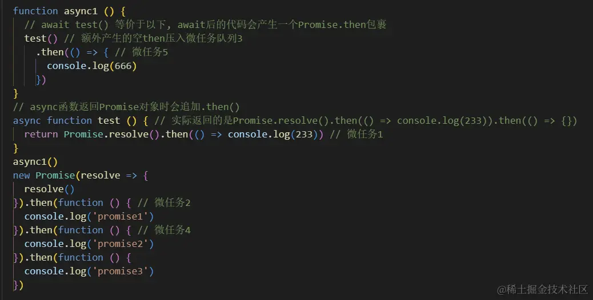

# 基本

### 事件循环

执行宏任务，然后执行该宏任务产生的微任务，若微任务在执行过程中产生了新的微任务，则继续执行微任务，微任务执行完毕后，再回到宏任务中进行下一轮循环。

#### 浏览器里的事件循环

JavaScript 代码的执行过程中，除了依靠函数调用栈来搞定函数的执行顺序外，还依靠任务队列(task queue)来搞定另外一些代码的执行。整个执行过程，我们称为事件循环过程。一个线程中，事件循环是唯一的，但是任务队列可以拥有多个。任务队列又分为 macro-task（宏任务）与 micro-task（微任务），在最新标准中，它们被分别称为 task 与 jobs。

`macro-task` 大概包括：

- script(整体代码)
- setTimeout
- setInterval
- setImmediate
- I/O
- UI render

`micro-task` 大概包括:

- process.nextTick
- Promise
- Async/Await(实际就是 promise)
- MutationObserver(html5 新特性)

**案例**

```js
console.log("script start");

async function async1() {
  await async2();
  console.log("async1 end");
}
async function async2() {
  console.log("async2 end");
  return Promise.resolve().then(() => {
    console.log("async2 end1");
  });
}
async1();

setTimeout(function () {
  console.log("setTimeout");
}, 0);

new Promise((resolve) => {
  console.log("Promise");
  resolve();
})
  .then(function () {
    console.log("promise1");
  })
  .then(function () {
    console.log("promise2");
  });

console.log("script end");

// start
// 2 end
// Promise
// end
// 2 end1
// promise1
// promise2
// 1 end
// setTimeout
```



#### node 里的事件循环

node 中也有宏任务和微任务，与浏览器中的事件循环类似，其中，

`macro-task` 大概包括：

setTimeout
setInterval
setImmediate
script（整体代码）
I/O 操作等。

`micro-task` 大概包括：

process.nextTick(与普通微任务有区别，在微任务队列执行之前执行)
new Promise().then(回调)等。

下面是 node 官网的事件循环简化图

```
   ┌───────────────────────────┐
┌─>│           timers          │
│  └─────────────┬─────────────┘
│  ┌─────────────┴─────────────┐
│  │     pending callbacks     │
│  └─────────────┬─────────────┘
│  ┌─────────────┴─────────────┐
│  │       idle, prepare       │
│  └─────────────┬─────────────┘      ┌───────────────┐
│  ┌─────────────┴─────────────┐      │   incoming:   │
│  │           poll            │<─────┤  connections, │
│  └─────────────┬─────────────┘      │   data, etc.  │
│  ┌─────────────┴─────────────┐      └───────────────┘
│  │           check           │
│  └─────────────┬─────────────┘
│  ┌─────────────┴─────────────┐
└──┤      close callbacks      │
   └───────────────────────────┘
```

图中的每个框被称为事件循环机制的一个阶段，每个阶段都有一个 FIFO 队列来执行回调。虽然每个阶段都是特殊的，但通常情况下，当事件循环进入给定的阶段时，它将执行特定于该阶段的任何操作，然后执行该阶段队列中的回调，直到队列用尽或最大回调数已执行。当该队列已用尽或达到回调限制，事件循环将移动到下一阶段。

因此，从上面这个简化图中，我们可以分析出 node 的事件循环的阶段顺序为：

输入数据阶段(incoming data)->轮询阶段(poll)->检查阶段(check)->关闭事件回调阶段(close callback)->定时器检测阶段(timers)->I/O 事件回调阶段(I/O callbacks)->闲置阶段(idle, prepare)->轮询阶段...

**阶段概述**

- 定时器检测阶段(timers)：本阶段执行 timer 的回调，即 setTimeout、setInterval 里面的回调函数。
- I/O 事件回调阶段(I/O callbacks)：执行延迟到下一个循环迭代的 I/O 回调，即上一轮循环中未被执行的一些 I/O 回调。
- 闲置阶段(idle, prepare)：仅系统内部使用。
- 轮询阶段(poll)：检索新的 I/O 事件;执行与 I/O 相关的回调（几乎所有情况下，除了关闭的回调函数，那些由计时器和 setImmediate() 调度的之外），其余情况 node 将在适当的时候在此阻塞。
- 检查阶段(check)：setImmediate() 回调函数在这里执行
- 关闭事件回调阶段(close callback)：一些关闭的回调函数，如：socket.on('close', ...)。

### require

当 Node 遇到 require(X) 时，按下面的顺序处理。

1. 如果 X 是内置模块（比如 require('http'）)
   a. 返回该模块。
   b. 不再继续执行。

2. 如果 X 以 "./" 或者 "/" 或者 "../" 开头
   a. 根据 X 所在的父模块，确定 X 的绝对路径。
   b. 将 X 当成文件，依次查找下面文件，只要其中有一个存在，就返回该文件，不再继续执行。
   X
   X.js
   X.json
   X.node
   c. 将 X 当成目录，依次查找下面文件，只要其中有一个存在，就返回该文件，不再继续执行。
   X/package.json（main 字段）
   X/index.js
   X/index.json
   X/index.node

3. 如果 X 不带路径
   a. 根据 X 所在的父模块，确定 X 可能的安装目录。
   b. 依次在每个目录中，将 X 当成文件名或目录名加载。

4. 抛出 "not found"

### 一些常用的方法、属性

- `__dirname`： 可以用来动态获取当前文件所属目录的绝对路径/获得当前执行文件所在目录的完整目录名
- `__filename`： 可以用来动态获取当前文件的绝对路径，包含当前文件/获得当前执行文件的带有完整绝对路径的文件名
- `__dirname` 和 `__filename` 是不受执行 node 命令所属路径影响的
  <br/>
- `process.cwd()`：获得当前执行 node 命令时候的文件夹目录名
- `process.argv`: 属性返回一个数组，这个数组包含了启动 Node.js 进程时的命令行参数
  - 数组的第一个元素 process.argv[0] ——> 返回启动 Node.js 进程的可执行文件所在的绝对路径
  - 第二个元素 process.argv[1] ——> 为当前执行的 JavaScript 文件路径
  - 剩余的元素为其他命令行参数
- `./`： 不使用 require 时候，./与 process.cwd()一样，使用 require 时候，与\_\_dirname 一样
  <br/>
- `path.join()`: 方法是将多个参数字符串合并成一个路径字符串
- `path.resolve()`: 方法是获取一个绝对路径，从最右边的参数作为起点，从右往左逐步将参数拼接在起点左边，直到解析出一个绝对路径，如果参数拼接完成后还是没有得到绝对路径，则将程序运行的绝对路径作为新参数拼到左边，在将结果返回
  <br/>
- `fs.stat()`: 获取文件信息，异步
- `fs.statSync()`: 获取文件信息，同步
  - 返回实例 stat 的常用方法
  - `stats.isFile()`: 如果是文件则返回 true,否则返回 false;
  - `stats.isDirectiory()`: 如果是目录则返回 true,否则返回 false;
  - `stats.isBlockDevice()`: 如果是块设备则返回 true，否则返回 false;
  - `stats.isCharacterDevice()`: 如果是字符设备返回 true,否则返回 false;
  - `stats.isSymbolicLink()`: 如果是软链接返回 true,否则返回 false;
  - `stats.isFIFO()`: 如果是 FIFO,则返回 true,否则返回 false.FIFO 是 UNIX 中的一种特殊类型的命令管道；
  - `stats.isSocket()`: 如果是 Socket 则返回 true,否则返回 false;
  - `stats.size()`: 文件的大小（以字节为单位）。

### 在 node 环境下执行原生 ESM 规范的脚本文件

将文件名后缀改为 .mjs 即可在文件中使用 ESM(什么版本的 node 开始支持，暂不清楚)，package.json 里 type 设置为 module 也可以使用 ESM

### 参考资料

- [阮一峰老师对 NodeJS require 的源码解读](https://baijiahao.baidu.com/s?id=1751105879667023594&wfr=spider&for=pc)
- [面试题：说说事件循环机制(满分答案来了)](https://juejin.cn/post/6844904079353708557?searchId=20240509112839C1C97E215B2BC58914C5#heading-4)
