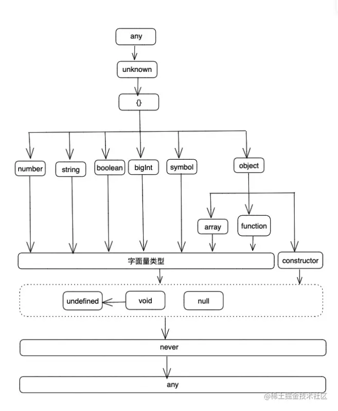

# 注意要点

1. 多个同名的 `interface` 、 `namespace` 、 `enum` 会自动合并
   - 命名空间还可以跟同名函数合并，但是要求同名函数必须在命名空间之前声明。这样做是为了确保先创建出一个函数对象，然后同名的命名空间就相当于给这个函数对象添加额外的属性。
2. 要想在 tsx 中使用泛型，需要在后面加一个`,`(逗号)
   - 正常写泛型语法会跟 tsx 语法冲突，他会把泛型理解成是一个元素
   ```ts
   // 此处将 T, 包裹是因为 markdown 格式化会将逗号去除
   const log = <`T,`>(str: T): void => {
     console.log(str);
   };
   ```
3. `extends`的用法

   - 类型组合
     extends 后可以跟多个类型，也可以跟 class，此时 class 会被视为对象的类型
     ```ts
     interface person {
       name: string;
     }
     interface man {
       age: string;
     }
     interface tom extends person, man {}
     ```
   - 面向对象中的「类」的继承
     extends 后只能跟一个类
     ```ts
     class people {}
     class man extends people {}
     ```
   - 泛型的类型约束
     - 基本模型: A 类型 extends B 类型? true: false
     - 只要 A 类型 是 B 类型 的子类型，结果即为满足约束
     - 如果类型 A 可以赋值给类型 B，TypeScript 就认为 A 是 B 的子类型（subtyping），B 是 A 的父类型。子类型满足父类型的所有结构特征，同时还具有自己的特征。凡是可以使用父类型的地方，都可以使用子类型，即子类型兼容父类型，反过来就不行
     - 我们可以根据下面的 「ts 类型层级关系图」来判断两种类型的父-子类型关系
     - 1）A -> B 表示「A 是 B 的父类型，B 是 A 的子类型」
     - 2）strictNullChecks 编译标志位打开后，undefined,void 和 null 就不会成为 typeScript 类型系统的一层，因为它们是不能赋值给其他类型的
     - 

   ```ts
   type UselessType<T extends number> = T;
   type Test1 = UselessType<any>; // √
   // any 是任何类型的子集，也是任何类型的父集。这里 typeScript 往宽松方向去处理，即取 number 的子集之意
   type Test1_1 = UselessType<number | string>; // 报错
   // number | string 之所以不能赋值给 number ，并不是因为 number | string 是 number 的父集，而是因为联合类型遇到 extends关键字所产生的「分配律」的结果。即是因为 number|string extends number的结果等于 (number extend number) | (string extends number)的结果。显然，(number string extends number的值是 false 的，所以，整个类型约束就不满足

   type UselessType2<T extends { a: 1; b: 2 }> = T;
   type Test2_2 = UselessType2<{ [key: string]: any }>; // 报错
   type Test2_3 = { a: 1; b: 2 } extends { [key: string]: any } ? true : false; // true
   // { a: 1; b: 2 } 满足 { [key: string]: any } 的所有结构，所以是其子类型
   ```

   - 在条件类型（conditional type）中，充当类型表达式，用于求值

     ```typescript
     T extends U ? X : Y
     ```

     上面式子中的`extends`用来判断，类型`T`是否可以赋值给类型`U`，即`T`是否为`U`的子类型，这里的`T`和`U`可以是任意类型。

     如果`T`能够赋值给类型`U`，表达式的结果为类型`X`，否则结果为类型`Y`

4. `infer`关键字用来定义泛型里面推断出来的类型参数，而不是外部传入的类型参数

   - 它通常跟条件运算符一起使用，用在`extends`关键字后面的父类型之中

   ```typescript
   type Flatten<Type> = Type extends Array<infer Item> ? Item : Type;
   ```

   上面示例中，`infer Item`表示`Item`这个参数是 TypeScript 自己推断出来的，不用显式传入，而`Flatten<Type>`则表示`Type`这个类型参数是外部传入的。`Type extends Array<infer Item>`则表示，如果参数`Type`是一个数组，那么就将该数组的成员类型推断为`Item`，即`Item`是从`Type`推断出来的。

   一旦使用`Infer Item`定义了`Item`，后面的代码就可以直接调用`Item`了。下面是上例的泛型`Flatten<Type>`的用法。

   ```typescript
   // string
   type Str = Flatten<string[]>;

   // number
   type Num = Flatten<number>;
   ```

   上面示例中，第一个例子`Flatten<string[]>`传入的类型参数是`string[]`，可以推断出`Item`的类型是`string`，所以返回的是`string`。第二个例子`Flatten<number>`传入的类型参数是`number`，它不是数组，所以直接返回自身。

5. `TypeScript 的 this 声明`：在 TypeScript 中，你可以显式声明 this 作为函数的第一个“形参”，但它只是类型声明，不影响实际传递的参数

   ```ts
   const fn = function (this, ...args) {
     console.log(args);
   };
   ```

   编译后，形参里的 this 并不会出现在产物之中

   ```js
   var fn = function () {
     var args = [];
     for (var _i = 0; _i < arguments.length; _i++) {
       args[_i] = arguments[_i];
     }
     console.log(args);
   };
   ```

6. `in`、`keyof`、`as` 运算符

   ```ts
   type A = {
     foo: number;
     bar: number;
   };

   type B = {
     [p in keyof A as `${p}ID`]: number;
   };

   // 等同于
   type B = {
     fooID: number;
     barID: number;
   };
   ```

   - `in`: 用来取出右侧的联合类型的每一个成员
   - `keyof A`: 返回类型`A`的每一个属性名，组成一个联合类型
   - `as + 新类型`: 键名重映射，可以对原始键名进行各种操作

7. `/// <reference path="..." />` 三斜杠引用

   - 三斜杠引用 表明 编译器在编译过程中包含额外的文件
   - 编译器对输入文件进行预处理时，会解析所有三重斜杠引用指令，将额外的文件被添加到编译中
   - 如果使用了**相对路径**，则三斜杠引用路径是相对于包含文件进行解析的

   - `/// <reference types="..." />`
     - 简单理解方式是导入声明包
     - 例如，在声明文件中包含 `/// <reference types="node" />`
       说明这个文件使用了`@types/node/index.d.ts`。因此，这个包需要连同声明文件一起包含在编译中
