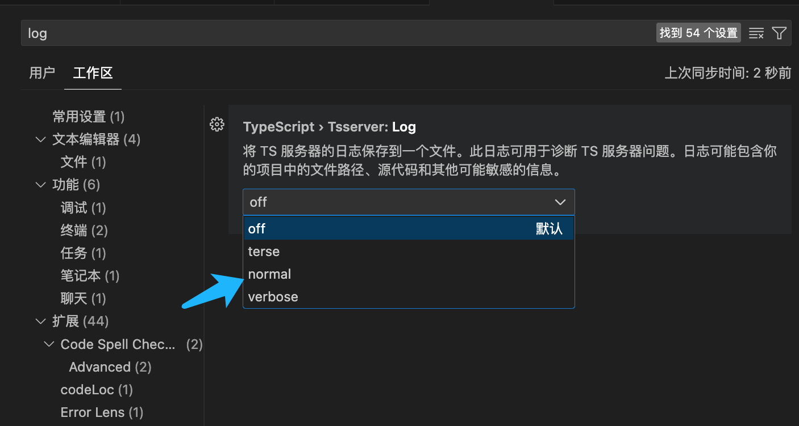
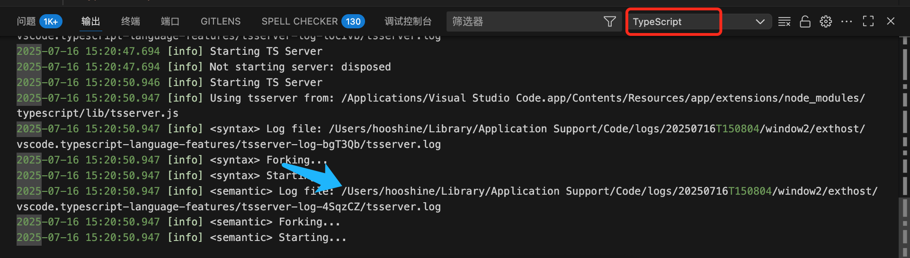
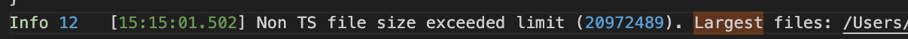
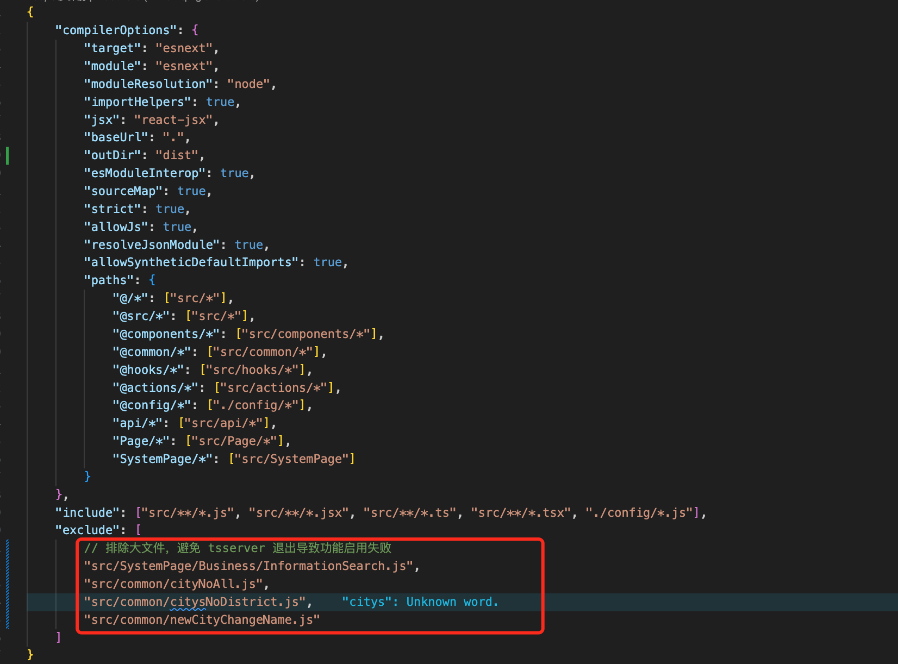

# 疑点记录

### 1.ts 里 `import type` 和 `export type` 的含义

```ts

import type { MyThing } from "./some-module.ts";

export type MyThing;

```

babel 这种编译工具不能准确的识别 MyThing 是个值还是类型，因为 babel 在编译过程中，一次只处理一个文件
使用 `import type` 和 `export type` 这形式可以准确的告诉编译器，这是一个类型，可以在编译的过程中将其省略(删除)
使用 import type 和 export type 导入和导出的类型只能在类型上下文中使用, 不能作为一个值来使用.

### 2.ts 里使用 node 的内置方法，提示找不到名称“process”

**背景**

开发前端部署工具途中，项目使用 ts + pnpm 搭建，安装了 `node-ssh` 作为链接服务器的工具，然后在其他文件使用 `node` 的内置方法就出现了如下错误.

```ts
// 退出进程
process.exit(0);

找不到名称“process”。是否需要安装 Node.js 的类型定义? 请尝试运行 `npm i --save-dev @types/node`。ts(2580)
```

查阅资料发现，如果安装的是 `^12.0.0` 版本的 `node-ssh`，直接使用 `process.exit(0)` 是不会出现这个错误的。
如果安装的是 `^13.1.0` 版本的，就会出现这个报错。需要在根目录下创建 `.npmrc` 文件，写入如下配置，将依赖提升，即可在正常使用 `process.exit(0)`

```sh
shamefully-hoist=true
# https://pnpm.io/zh/npmrc#shamefully-hoist
```

### 3.vscode 内方法无法跳转到实现的地方，允许查看文件引用报错

**背景**

vscode 打开项目后，提示 `To enable project-wide JavaScript/TypeScript language features, exclude large folders with`（若要启用项目范围内的 JavaScript/TypeScript 语言功能，请排除包含不需要处理的源文件的大型文件夹）

唤出终端，切换到【输出】tab，切换到 `typescript` 可以看到日志如下，tsserver 报错退出了

```sh
[error] TSServer exited. Code: null. Signal: SIGTERM
```

**原因**

查阅资料得知，是因为项目中体积过大的文件也参与到编译当中，导致功能启用失败

**解决办法**

1. `cmd + shift + P` 打开命令面板，打开 `setting` 面板，在其中输入 `log`
2. 找到 `TypeScript › Tsserver: Log`，将其选项改为 `normal`，即会输出 日志文件
3. 再去 typescript 的输出面板，找到生成的 log 文件
4. 打开 log 文件，搜索 `largest` ，找到大小超出限制的文件列表，将他们添加到 `tsconfig.json` 中到 `exclude` 中即可解决






### 参考资料

[import 和 import type 的区别](https://juejin.cn/post/7111203210542448671)
