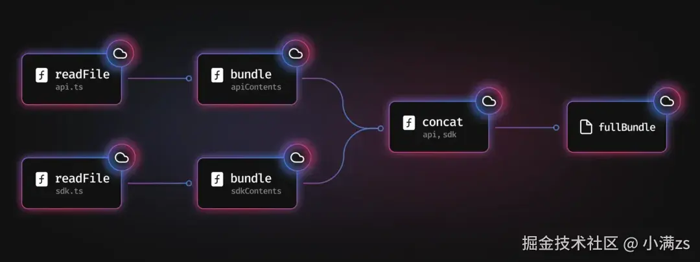
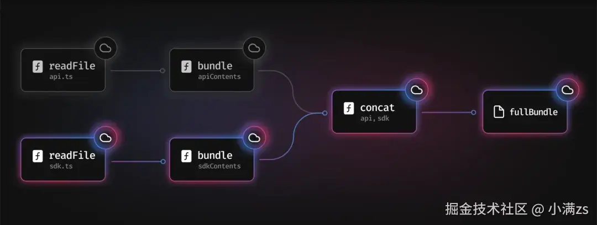

# Turbopack

Turbopack 是一个增量打包器，用于取代 `webpack`,它是用 Rust 语言编写,并且 Turbopack 转换 js/ts 使用的是 `SWC`,他比 vite 快 10 倍，比 webpack 快 700 倍，速度更快，性能更优。

## 核心原理

Turbopack 是函数级别的缓存，可以将某些函数，进行标记，当这些函数被调用时，会记住他们被调用的内容，保存到缓存中。

首先我们看到有两个文件 `api.ts`/ `sdk.ts` 都调用了 `readFile 函数`，然后把这两个文件打包成 `bundle`,然后拼接起来,最后打成一个 `fullBundle`

例如 `sdk.js` 发生了变化，而 `api.js` 没有改变，所以他就只会打包 `sdk.js`,而不会打包 `api.js`,只需要从缓存中读取 `api.js` 内容即可，这样就可以节省非常多的时间，意味着它永远不需要执行两次相同的工作。
